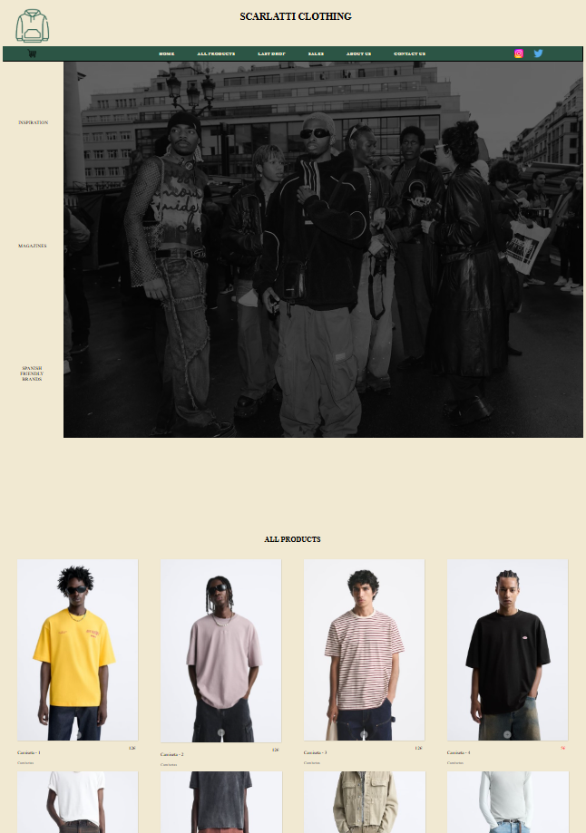

# 🎽 Tienda Web Ropa

Este es un proyecto que implementa una página web para una tienda de ropa. El proyecto está desarrollado utilizando HTML y CSS , lo que lo hace fácil de entender, personalizar y extender. 

## ✨ Características

- 🌐 **Diseño responsivo**: Compatible con diferentes tamaños de pantalla (móviles, tabletas y escritorios).
- 🛍️ **Catálogo de productos**: Muestra una lista de productos con imágenes, nombres y precios.
- 🗂️ **Barra de navegación**: Incluye enlaces a diferentes secciones de la página.
- 🌟 **Estilo moderno**: Utiliza CSS para un diseño atractivo y limpio.

## 📷 Captura de Pantalla

## 🔧 Requisitos

Este proyecto no requiere dependencias externas ni servidores locales. Solo necesitas un navegador web moderno para ejecutarlo.

## ℹ️ Instalación y Uso

Sigue estos pasos para instalar y usar el proyecto:

1. **Clona el repositorio**:
   git clone https://github.com/mariodiazzz11/TiendaWebRopa.git
2. **Accede al directorio del proyecto**:
   cd TiendaWebRopa
3. **Abre el archivo principal**:
   - Ubica el archivo index.html en el directorio
   - Haz doble clic para abrirlo en tu navegador

## ⚙️ Personalización

Puedes personalizar el contenido y los estilos según tus necesidades:

- Edita index.html para cambiar los productos, textos y estructura.
- Modifica style.css para ajustar los colores, fuentes y diseño.

## 🚀 Contribuciones 

Si deseas contribuir a este proyecto:

1. **Haz un fork del repositorio.**
2. **Crea una rama para tus cambios**:
   git checkout -b nombre-de-tu-rama
3. **Realiza tus modificaciones y haz un commit**:
   git commit -m "Descripción de tus cambios"
4. **Envía un pull request**

## ✉️ Licencia

**Este proyecto está bajo la Licencia MIT. Consulta el archivo LICENSE para más información.**
